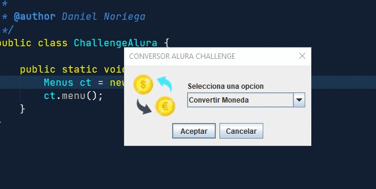
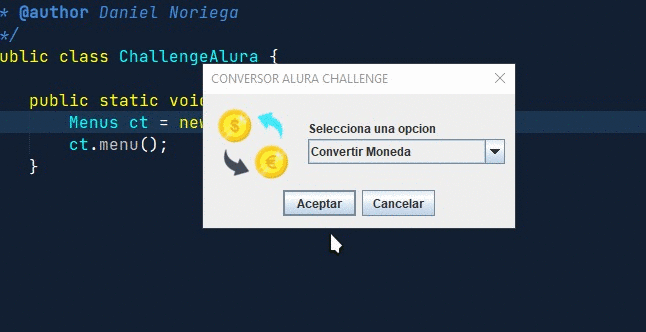
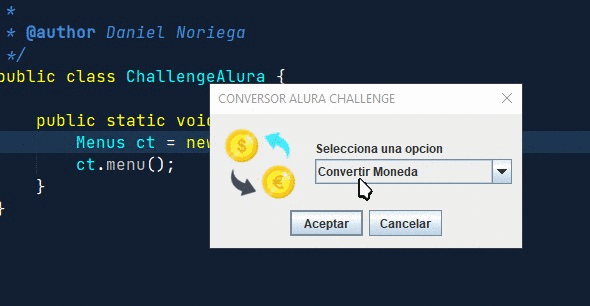
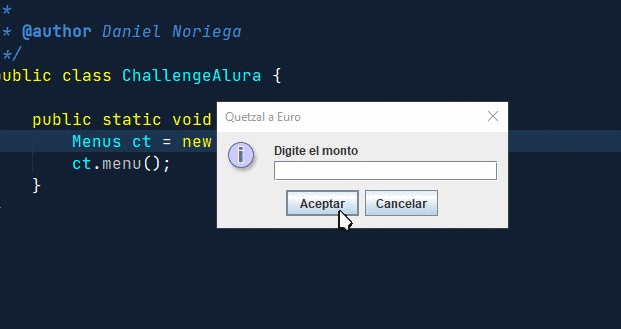
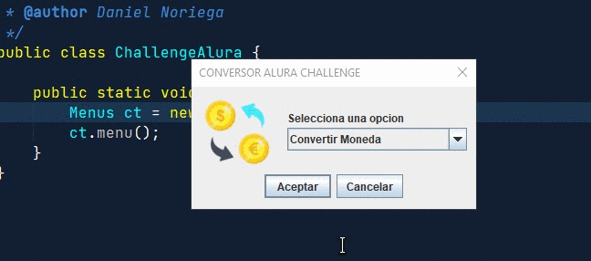
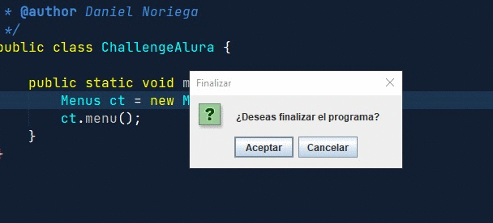

# Conversor de monedas con Java

## Indice
- [Instalacion de programa](#instalación-del-programa)
- [Conversor de monedas](#demostración-de-conversor-de-monedas)
- [Conversor de temperatura](#demostración-de-conversor-de-temperatura)
- [Conversor de longitudes](#desmostración-de-conversor-de-longitudes)
- [Manejo de errores](#manejo-de-errores)
- [Regresar a submenus](#regresar-al-submenu)
- [Finalizar el programa](#finalizar-programa)


## Instalación del programa
Puede variar la ruta para poder clonar el repositorio en tu computadora, pero normalmente por defecto se guarda dentro de la carpeta __Documentos/NetbeansProjects__ te dejo algunas opciones para ir a la carpeta:

Por si estas desde la carpeta raiz de tu computadora:
```bash
cd Documents/NetBeansProjects
```

En caso la primera no te funciones es porque los nombres de las carpetas de tu computador, posiblemente esten en español, entonces puede utilizar este:
```bash
cd Documentos/NetBeansProjects
```

Si no estas en la carpeta raiz de tu computadora:
```bash
 cd ~ && cd Documents/NetBeansProjects
```

Para clonar el repositorio en __NetBeansProjects__:
```bash
git clone https://github.com/Noriega402/Challenge-conversor-de-monedas-Oracle-One.git
```

__NOTA:__ si quieres cambiar el nombre de la carpeta puedes hacerlo de esta manera:
```bash
git clone https://github.com/Noriega402/Challenge-conversor-de-monedas-Oracle-One.git <nombreNuevo>
```

Por ejemplo:
```bash
git clone https://github.com/Noriega402/Challenge-conversor-de-monedas-Oracle-One.git challegeAlura
```

## Demostración de conversor de monedas
Uso para hacer un conversion de monedas de guatemala:



## Demostración de conversor de temperatura
Uso para hacer una conversion de temperatura:



## Desmostración de conversor de longitudes
Uso para hacer conversion de longitudes
__NOTA:__ solo para kilometros, metros, centimetros, milmetros y pulgadas.



## Manejo de errores
Para cada conversion de medidas hay mensajes de error en caso el usuario no ingrese un valor válido o deje el campo en blanco:



## Regresar al submenu
Para cada opcion (monedas, temperatura y longitud) hay una opcion para regresar al submenu en caso se haya equivocado de opcion:



## Finalizar programa
En caso el usuario no quiera seguir realizando conversiones de algun tipo, puede cerrar el programa, ahora si aun desea seguir realizando conversiones el programa regresa al menu principal:

